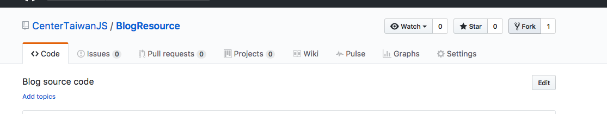
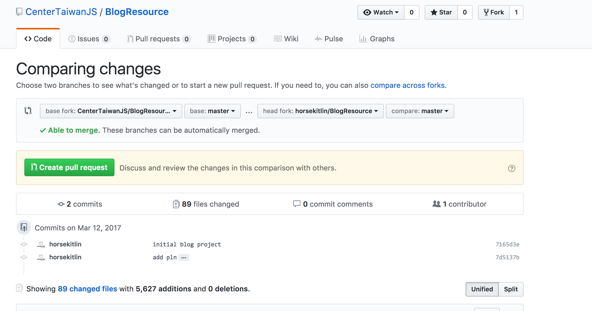
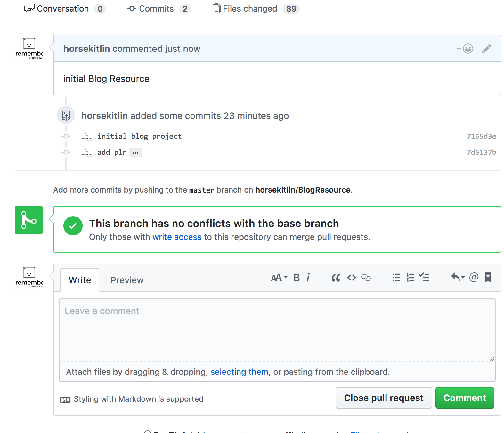
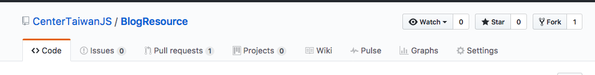
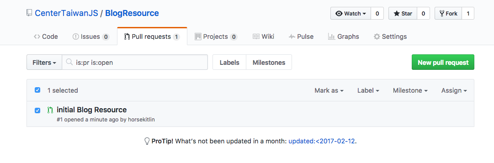
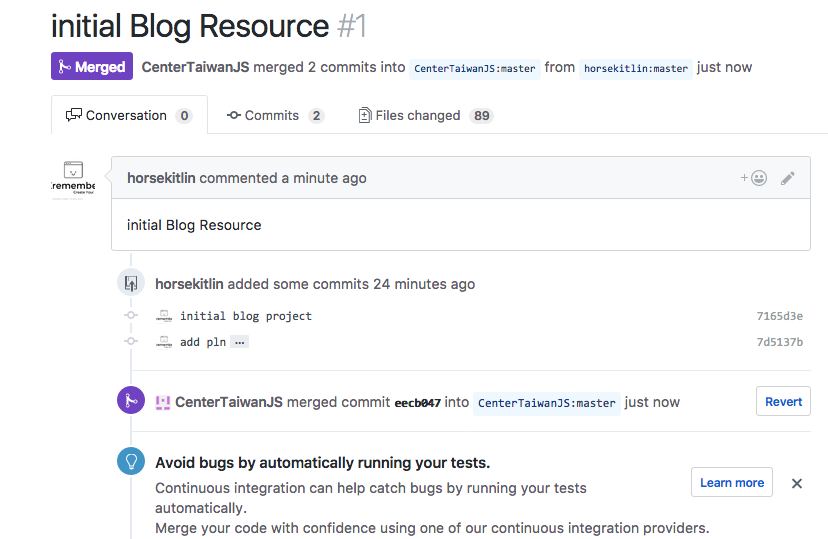
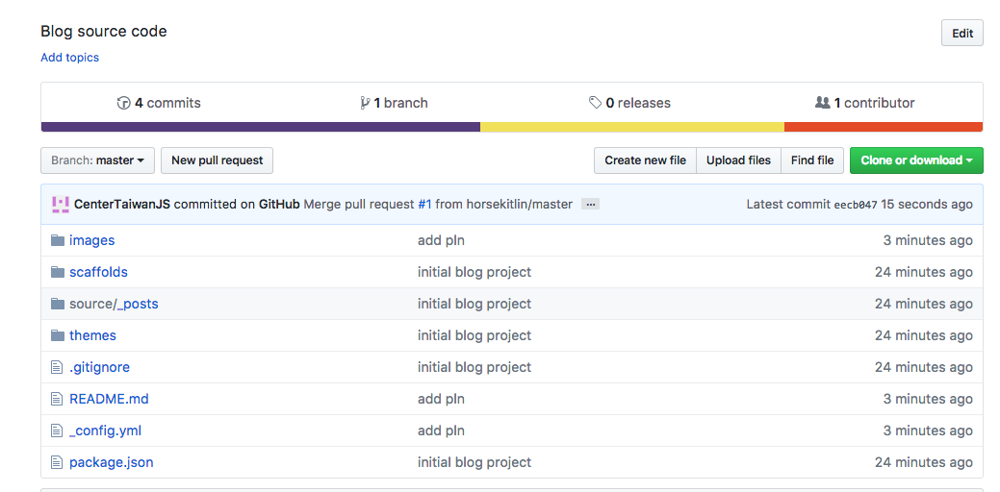

# BlogResource
Blog source code

## Install 

1. Install Hexo

[Hexo Install](https://hexo.io/docs/#Installation)

2. Fork the blog resource



3. 在你的Repo中 clone BlogResource

```
  $ git clone git@github.com:${yourname}/BlogResource.git
```

3. create new post

```
  $ hexo new post ${Title}
```

4. 寫文章

5. commit

```
  $ git commit -am '名字:日期:文章抬頭'
```

6. Push

```
git push origin master
```

7. Pull Request

  1 點擊Pull Request

  

  2 New pull request

  

  3 確認 PR的Commit

  

  4 確認送出Pull Request

  

    PR結束，接下來是Peter的部分

  5 點擊Pull Request

  

  6 點擊pr的標題

  

  7 Merge pull request

  

  8 Merge 完成

  

  9 Merge 完成

  